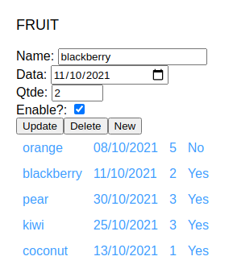
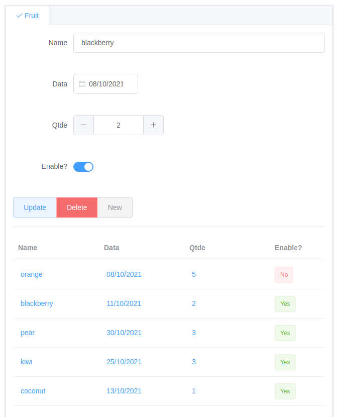

# Vue Component Builder
Generate Vue component CRUD from Rails model mapping

### Preview

Default theme



Element-plus theme




### Compatibility

vue 3.x to element-plus theme

### Install

In development section of your **Gemfile** put:

```ruby
gem 'vue_component_builder'
```

And run

```shell
$ bundle install
```

### Features

 - Generate validate inputs from model validates roles;
 - Generate Vue methods hook with create, show, update, list and destroy javascript methods with Axios api calls template;
 - Recognize model attributes types (string, integer, datetime, date, decimal) and generate form fields according to them;
 - Mapping labels of form component from the i18n model;
 - Generate table list of in the same screen;
 - Exclude attributes models option;
 - Select theme [element-plus](https://element-plus.org/). (is default) 

### Usage

```ruby
model=Fruit
component=MyFruitComponent
theme=default [default or element-plus]
exclude=id,created_at,updated_at [optional]
```

Note: Your model and controller must be created (e.g Fuit model and FruitsController)

```shell
rails g vue_component_builder:new model=Fruit  component=MyFruitComponent theme=default exclude=id,created_at,updated_at
```

The new component will be generated inside in your Rails public folder 
```shell
public/MyFruitComponent.vue
```
Then you can copy this component to your Vue application folder.

### TODO / coming soon

- Implement gem test;
- More theme options like Vuesax, BootstrapVue, Buefy or  PrimeVue;
- Output directory option of generated component.
- Add search option in table;
- Add filter in table.
- Use vuex state management pattern instead of using the date method (the current way is't not good practice)
